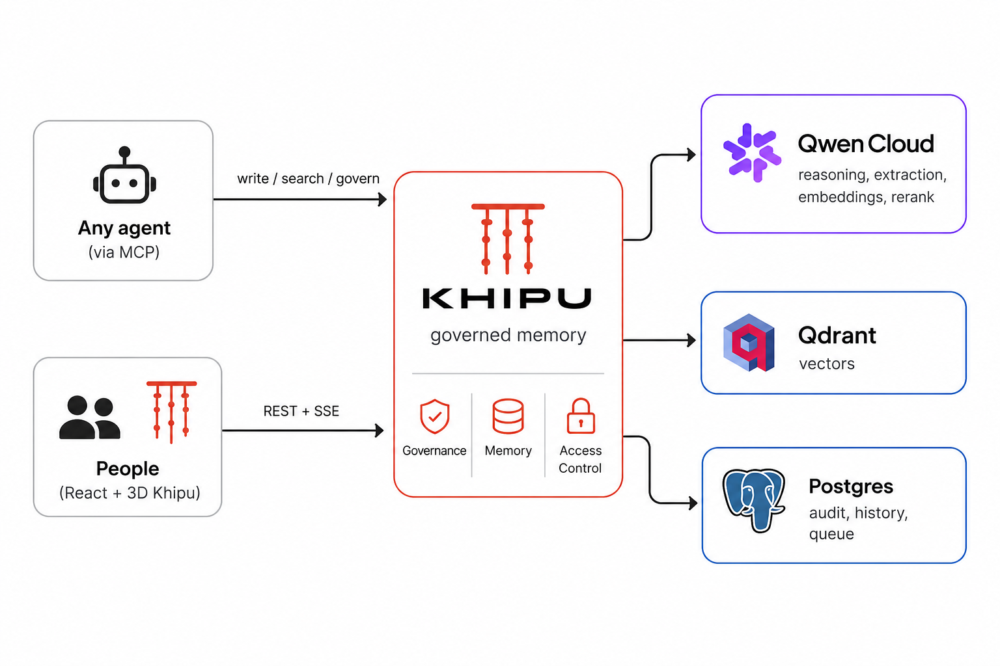
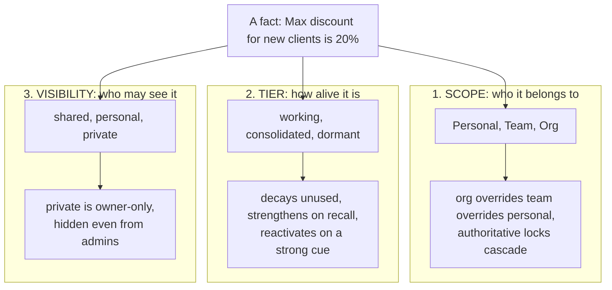
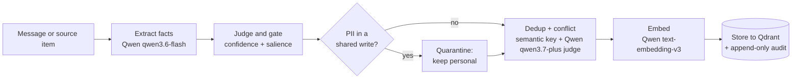
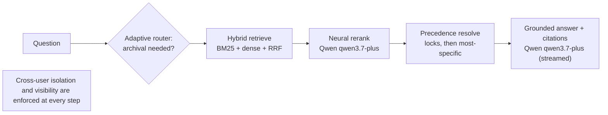
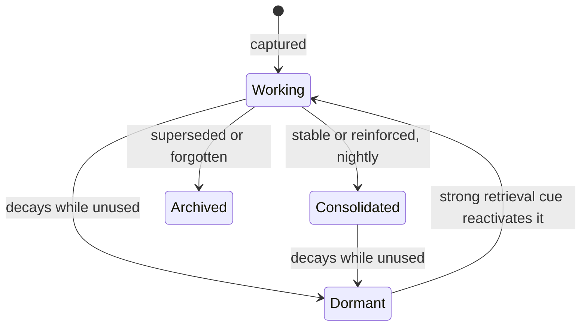

<div align="center">

<picture>
  <source media="(prefers-color-scheme: dark)" srcset="docs/logo-dark.svg">
  
</picture>

### Trustworthy institutional memory for AI agents

*A governed, multi-tenant memory layer where every fact knows who it belongs to, how alive it is, and who may see it, so agents recall the right context across sessions and never the wrong one.*


</div>

---

> A **khipu** is an Inca device of knotted cords that recorded the memory of an entire civilization, outliving any single person. Khipu, the project, does the same for AI agents: it turns scattered, session-bound context into **institutional memory** that is persistent, structured, and *governed*.

Built for the **MemoryAgent** track of the Qwen Cloud Global AI Hackathon.

## The problem

Agent memory today is a bag of embeddings. That is fine for one user in one session. It breaks the moment memory becomes **shared, long-lived, and trusted for decisions**:

- **Whose fact wins?** Sales says "25% discount", company policy says "20%". A plain vector store returns both and the agent picks one at random.
- **Is it still true?** A fact from six months ago sits next to today's with equal weight.
- **Who may see it?** A private salary note and an org-wide policy live in the same index.
- **Can I trust it?** No provenance, no audit, no way to correct a bad memory, no isolation between users.

For a memory agent, the hard part is not *storing* memory. It is making shared, persistent memory **trustworthy enough for an agent to act on**. That is what Khipu governs.

## Why it matters

Any team that puts an agent to work on shared knowledge, a support copilot, a sales assistant, an internal operations agent, hits the same wall: the memory has to be correct, current, private, and accountable, or the agent cannot be trusted with a real decision. Khipu turns agent memory from a liability into infrastructure an organization can actually rely on. The very properties that make it trustworthy, precedence and authoritative locks, per-owner privacy, an append-only audit trail, versioned history, and cross-user isolation, are exactly what enterprise and regulated settings require: access control, provenance, and the ability to correct or forget a fact on demand.

Its reach is not tied to one app or one model. Any agent talks to it over the Model Context Protocol, the AI layer is a generic adapter that runs on any OpenAI-compatible endpoint, and the whole system is multi-tenant by design and MIT-licensed. That makes it equally viable as a self-hosted governed memory layer inside a company and as an open-source component the community can extend. The shift is the point: where most agent memory is a bag of embeddings optimized for recall, Khipu treats shared, long-lived memory as governed infrastructure, with the scope, lifecycle, and access rules that real organizations actually run on.

## What Khipu is

A memory service, and a live product around it, that governs every fact on **three independent axes**, runs a real write-and-recall pipeline **entirely on Qwen Cloud**, ages memory **autonomously**, and exposes itself to **any agent over MCP**.

<p align="center">
  
</p>

---

## The three-axis memory model

The core idea. Every memory is a point in a three-dimensional grid. This is what turns "a bag of vectors" into governable institutional memory.



| Axis | Values | What it governs |
|---|---|---|
| **Scope** | `personal`, `team`, `org` | **Precedence resolution.** A company lock overrides a team norm, which overrides a personal preference. Authoritative locks **cascade** onto conflicting lower-scope facts. |
| **Tier** | `working`, `consolidated`, `dormant` | **Lifecycle.** Facts gain strength when reinforced, decay when unused, sink to a cold archive, and **reactivate** on a strong retrieval cue. |
| **Visibility** | `shared`, `personal`, `private` | **Access.** `private` is strictly owner-only. It is stripped server-side before serialization, so it never reaches any other client, not even an admin's. |

Memories are also typed (`episodic`, `semantic`, `preference`, `procedural`) and carry provenance, consent, PII flags, versions and expiry.

## The Memory Matrix

Scope times Tier is a 3x3 grid that real organizations populate **unevenly**. Company knowledge concentrates in stable, consolidated cells; personal memory spans the whole range. The 3D khipu view arranges every memory along exactly these axes (scope by position on the cords, tier by knot color), so the uneven shape of an org's memory is visible at a glance.

|  | Working *(fresh)* | Consolidated *(stable)* | Dormant *(cold archive)* |
|---|---|---|---|
| **Org** | rare *(policies are born stable)* | policies and locks *(max discount 20%)* | superseded org facts |
| **Team** | this week's decisions | team norms *(25% with VP sign-off)* | stale practices |
| **Personal** | recent chatter | preferences *(prefers 25-min meetings)* | old notes |

The same fact can move between cells over time (decay, consolidation, reactivation) without ever losing its scope or visibility.

---

## Long-term memory, by design

Khipu is built to be useful not for a single prompt but across many turns and many sessions, which is where most agent memory quietly fails. Each property below is a concrete mechanism, not a promise.

**Persistent across sessions.** Memory lives in Qdrant (vectors) and Postgres (audit, history, promotions, and per-user conversations), never in a request-scoped buffer. Restart the process and every fact, every past version, and every pending approval is still there. Cross-session recall is the default behavior, not a feature bolted on top.

**Accumulates experience on its own.** Every message, and every connected source (Slack, email, calendar, kanban, company handbook), runs through the write pipeline that distills durable facts. Memories that get recalled are reinforced, so their strength rises and the knowledge the agent actually uses becomes more prominent over time. A background scheduler ages the whole store with no human input: an hourly pass recomputes strength and expires time-bound facts, and a nightly pass consolidates and de-duplicates. The store grows richer and cleaner with use, not merely larger.

**Treats preferences as first-class facts.** A preference is its own memory type, alongside episodic, semantic, and procedural, and usually lives at personal scope. "Prefers 25-minute meetings" or "always copy the account owner" are captured, typed, and surfaced when relevant, kept separate from volatile chatter so an agent can adapt to each individual.

**Converges on the correct decision.** When two facts disagree, say a 20% company policy against a 25% team practice, a plain vector store returns both and leaves the agent guessing. Khipu resolves precedence before it answers: an authoritative lock wins, otherwise the most specific scope wins, and the reason is attached to the citation. Together with reranking, the agent settles on the right call across turns instead of oscillating, and consolidation hardens the facts that prove stable while one-off noise fades.

**Efficient to store and to retrieve.** On the way in, a new fact is de-duplicated against its nearest neighbours (a cheap cosine prefilter confirmed by an LLM judge), so the store never fills with near-copies; an update lands on the right fork and supersedes the previous version rather than piling up. On the way out, retrieval is hybrid (lexical BM25 plus dense vectors fused with reciprocal-rank fusion), an adaptive router decides whether the cold archive even needs to be touched for a given question, and a reranker trims the result to a handful of the most relevant items. No query round-trips the entire store.

**Forgets what is no longer true, on time.** Memory is not append-forever. Each fact carries a strength that decays on a forgetting curve when it goes unused, sinking from working to a dormant cold archive. Time-bound facts expire at their valid-until date, and a newer fact supersedes and archives the stale one that shares its key. Outdated information stops competing for the agent's attention automatically, while durable, pinned, or locked facts are protected from decay.

**Recalls the critical few within a tight context budget.** Context windows are finite, so Khipu never dumps the whole store into the prompt. A small core of the most important memories, the authoritative locks and pinned facts, is kept in context for every query regardless of the question, so a company policy is never crowded out by recent chatter. Around that core, retrieval adds only what the router judges necessary, the reranker caps the set, and precedence collapses conflicting facts to a single winner. A dormant memory that suddenly becomes relevant is reactivated by a strong retrieval cue. What finally reaches the model is small, current, and the right set of facts.

---

## The math behind it

Every governance decision reduces to a small, explicit rule. Nothing below is a black box; each formula maps to a function in the domain layer.

**Memory as a lattice.** A memory is a point in a discrete product space, and governance acts on each axis independently:

$$ m \in \underbrace{\{\text{personal} < \text{team} < \text{org}\}}_{\text{scope}}\ \times\ \underbrace{\{\text{working} \to \text{consolidated} \to \text{dormant}\}}_{\text{tier}}\ \times\ \underbrace{\{\text{shared},\ \text{personal},\ \text{private}\}}_{\text{visibility}} $$

This is why a single fact can decay along the tier axis without ever changing who owns it or who may read it.

**Forgetting curve with reinforcement.** Strength follows an exponential decay (an Ebbinghaus forgetting curve), but the half-life stretches each time the memory is recalled, so useful knowledge resists being forgotten:

$$ s(m, t) = \sigma \cdot \exp\!\left(-\frac{\Delta t}{\tau}\right), \qquad \tau = H_{\text{type}}\,\bigl(1 + \kappa \ln(1 + n)\bigr) $$

with salience $\sigma \in [0,1]$, days since last access $\Delta t$, access count $n$, reinforcement gain $\kappa = 0.5$, and type-dependent base half-lives $H$: preference 180 d, semantic 90 d, episodic 14 d, procedural 365 d. A working memory drops to the dormant archive once $s < 0.3$; authoritative or pinned memories are exempt ($\tau \to \infty$). The $\ln(1 + n)$ term is spaced repetition: early recalls extend a memory's life sharply, later ones with diminishing returns.

**Hybrid retrieval by Reciprocal Rank Fusion.** Dense (vector) and lexical (BM25) rankings are fused rank-wise, which is robust to the score-scale mismatch between the two retrievers:

$$ \operatorname{RRF}(m) = \frac{1}{k + r_{\text{dense}}(m)} + \frac{1}{k + r_{\text{bm25}}(m)}, \qquad k = 60 $$

Cosine similarity drives the dense order. A candidate is considered for merging only when $\cos(\mathbf{e}_a, \mathbf{e}_b) \ge 0.78$ and an LLM judge confirms the two facts are the same; a dormant memory reactivates when a query cue clears $\cos \ge 0.45$.

**Precedence as a lexicographic order.** Conflicting facts collapse to one winner by a deterministic key. With specificity $\rho(\text{org}) = 1 < \rho(\text{team}) = 2 < \rho(\text{user}) = 3$ and recency $t$:

$$ \text{winner} = \begin{cases} \arg\min_{m}\ \bigl(\rho(m),\ -t_m\bigr) & \text{if any fact is locked} \\[4pt] \arg\max_{m}\ \bigl(\rho(m),\ t_m\bigr) & \text{otherwise} \end{cases} $$

An authoritative lock wins, and among locks the most global one (org) outranks a team lock; without a lock, the most specific scope wins, with recency breaking ties. This is what makes the agent answer "20% (company policy, locked)" instead of guessing.

**A bounded context budget.** For each query the prompt is assembled as a fixed-size set, not the whole store:

$$ \mathcal{C} = \underbrace{\text{core}}_{\text{locks + pins},\ \lvert\cdot\rvert \le 8}\ \cup\ \underbrace{\text{top-}n\ \text{reranked}}_{n = 6\ \text{of up to}\ 50\ \text{retrieved}} $$

The core is always present, so critical policy never falls out of context; everything else competes for the remaining slots.

---

## Architecture

Hexagonal (ports and adapters). The domain never imports a vendor SDK. All AI goes through one generic REST adapter, so the **entire model stack is Qwen Cloud** and is swappable by config alone.

<p align="center">
  
</p>

**Stack:** FastAPI, Qdrant, Postgres, Docker Compose, React 19 + TypeScript + three.js, APScheduler, Model Context Protocol. The stores fall back to in-memory for zero-setup dev; `require_persistence` fails loud in production.

---

## How memory is written

Not "embed and dump". Every fact runs a Qwen-powered pipeline that extracts, judges, de-duplicates, resolves conflicts and quarantines sensitive data before anything is stored.



- **Conflict-aware.** An update lands on the *right fork* by scanning nearest neighbours and confirming with an LLM judge, so it never corrupts a distinct memory.
- **Prompt-injection flagging.** Inputs matching override or bypass patterns are recorded in the audit trail; isolation is still enforced at the data layer regardless.

## How memory is recalled

Governed retrieval, not raw similarity. The agent gets a grounded answer with **citations and precedence already resolved**.



Ask *"what's the max discount?"* and Khipu answers **20% (company policy, locked)**, notes the 25% team practice, and explains that it does **not** override the lock, with citations pointing at each source fact.

---

## When memories contradict

Real institutional memory contradicts itself constantly: a policy is updated, a team norm diverges from the company default, someone corrects an earlier note. A plain store keeps all of it and hands the agent the pile. Khipu keeps the store honest and returns one consistent answer, resolving contradictions at three stages.

**At write time, an update finds its own fork.** A new fact is compared against its nearest neighbours by an LLM judge (the `qwen3.7-plus` conflict model) that labels the relationship *same*, *update*, or *unrelated*. An update reconciles onto the existing memory's key and supersedes the previous version, which is archived rather than deleted, so the full lineage survives. A fact that only clashes with *unrelated* memories is given a fresh key, so distinct knowledge is never lost to a key collision. This is what stops a correction from silently overwriting a genuinely different memory, and stops near-duplicates from piling up.

**Same scope is a conflict; a different scope is a layer.** Two facts under one key at the *same* scope that disagree are a real contradiction. The *same* key at *different* scopes is intentional layering: a team practice deliberately sitting under a company default, not a bug. Khipu separates the two, so it never flags a legitimate override as an error, nor buries a real conflict as if it were harmless layering.

**Genuine conflicts surface for a keeper.** A same-scope contradiction appears in a review queue with its contenders side by side. The keeper can replace (lock the winner, which cascades and archives the losing versions), keep both (re-key them so they coexist as distinct facts), edit the wording, or dismiss the suggestion. An authoritative lock is never overwritten by a later automatic write.

**Even unresolved, recall stays consistent.** If a contradiction has not been resolved yet, precedence collapses it to a single winner before the agent sees anything: an authoritative lock wins, otherwise the most specific scope wins, and the citation states the reason. The agent is never handed two conflicting facts at once. The store may hold the full, messy history; the answer is always one current, correctly prioritized fact.

---

## Autonomous lifecycle

Memory manages itself. An in-process scheduler ages the whole store with **zero human input**, which is the "learns over time" part of a memory agent.



- **Decay** (hourly): recomputes strength on a forgetting curve, expires time-bound facts, fades unused ones to dormant.
- **Consolidation** (nightly): dedups same-key facts and promotes stable working memories to consolidated.
- Both are also triggerable on demand from the UI, so you can *watch* the lifecycle during a demo.

## Trust and safety

| Guarantee | How |
|---|---|
| **Cross-user isolation** (target leak rate 0%) | Enforced at the data layer. A built-in red-team endpoint probes every user pair and reports the leak rate. |
| **Private is owner-only** | A private memory is `hidden` for everyone except its owner (admins included). It is stripped server-side, so it never leaves the backend. Admins governing a scope see only an anonymous count of private items held there. |
| **PII quarantine** | Sensitive content never enters shared memory directly. It lands personal and can later be promoted, sanitized, through the approval queue. |
| **Injection flagging** | Override and bypass attempts are recorded in the audit trail. |
| **Full accountability** | Append-only audit, per-memory version history, restore, and explicit consent to be used in answers. |

## Governance

Every fact is inspectable, correctable and forgettable by its keeper, with the authority model built in.

- **Approval queue.** Non-governors *propose* team or org facts; the target scope's lead or admin approves. An approved proposal consumes the originating source item, so the same knowledge is never shared twice.
- **Conflict resolution.** Same-scope divergences are surfaced as a real conflict; pick the winner, keep both (re-key), edit the wording, or dismiss.
- **Authoritative locks.** An admin or lead locks a fact; it wins precedence and **cascades** over conflicting lower-scope facts.
- **Ledger, audit and versioning.** Pin (protect from decay), edit, forget, restore any version, widen scope, change visibility.

---

## Use it from any agent (MCP)

Khipu ships as a **Model Context Protocol server**, so any MCP-capable agent gets governed, isolated memory as first-class tools with no bespoke integration.

```bash
python -m app.adapters.inbound.mcp.server
```

| Tool | What it does |
|---|---|
| `memory_search(query, profile_id)` | Answer grounded in the caller's governed, isolated memory, with citations. |
| `memory_write(content, profile_id)` | Remember a new fact (dedup and conflict aware). |
| `memory_govern(memory_id, action, profile_id)` | `forget`, `pin` or `unpin` a memory the caller owns. |
| `memory_stats(profile_id)` | How many memories are visible to this profile. |

Isolation and visibility are enforced *inside* the tools, so an agent physically cannot read another user's private memory.

## Qwen Cloud models

Every model call runs on **Qwen Cloud (DashScope)** through one generic `RestLLMProvider` over the OpenAI-compatible endpoint. No vendor names leak into the domain code.

| Role | Qwen model | Used for |
|---|---|---|
| Reasoning, answers, judge | **`qwen3.7-plus`** | Grounded streamed answers, accept and conflict judging |
| Fast extraction | **`qwen3.6-flash`** | Distilling facts from messages and sources |
| Embeddings | **`text-embedding-v3`** (1024-dim) | Hybrid dense retrieval (chunked to the API's batch limit of 10) |
| Reranking | **`qwen3.7-plus`** | LLM reranker, Qwen-native, no separate rerank endpoint |

Because the provider is a generic REST adapter, the stack points at any OpenAI-compatible endpoint by changing `QWEN_BASE_URL` and the model names in `.env` (see `.env.example`).

## Sources

Per-user connectors (**Slack, email, calendar, kanban, company handbook**) let people turn real signals into governed memory. The action adapts to content scope times your authority: **Save** (personal), **Ingest** (you govern it), or **Propose** (needs approval).

A shared item is consumed **globally** only by the first **direct shared ingest**, or when the first **proposal is approved**. Personal saves and still-pending proposals stay **per-user**, so proposing a team fact never blocks a teammate from capturing the same item.

## The Khipu visualization

The React SPA renders memory as an actual **3D khipu** (three.js): a primary cord with per-team pendants and colored knots for each memory (scope by position, tier by color). A memory that is private to someone else never appears; only its owner can see it. Toggle to a filterable list, open any knot in the inspector, or use "view as" a different person to *see* isolation in action.

---

## Quick start

```bash
# 1) Configure your Qwen Cloud key (get one at home.qwencloud.com/api-keys)
cp backend/.env.example backend/.env
#   set QWEN_API_KEY=sk-...   (sk-sp-... keys need the Token Plan base URL, see the file)

# 2) Bring up the full stack (backend + Qdrant + Postgres)
cd infra && docker compose up --build      # API at http://localhost:8000/docs

# 3) Frontend
cd ../frontend && npm install && npm run dev   # at http://localhost:5173
```

The backend seeds a demo org on boot and ages it automatically. Everything runs on Qwen Cloud.

## Verify

The test suite runs on in-memory fakes, so no external services (and no API key) are required. Set up the backend dev environment once, then run it:

```bash
cd backend
python -m venv .venv
./.venv/Scripts/pip install -e ".[dev]"        # Linux/Mac: .venv/bin/pip install -e ".[dev]"
./.venv/Scripts/python -m pytest -q            # 67 tests: precedence, privacy, red-team, lifecycle
```

The red-team probe runs against the live stack from the quick start:

```bash
curl -X POST "localhost:8000/admin/redteam?profile_id=elena"   # admin-only, returns {"leak_rate": 0.0, ...}
```

## API (selected)

| Method | Endpoint | Purpose |
|---|---|---|
| `POST` | `/chat/stream` | Streamed, grounded answer with citations |
| `POST` | `/chat/capture` | Extract memory candidates from text |
| `POST` | `/memory/save` | Save, ingest or propose a fact (authority aware) |
| `GET` | `/memory` | Governed, visibility-filtered memory list |
| `POST` | `/memory/{id}/authoritative` | Lock a fact (cascades) |
| `GET` | `/promotions`, `POST` `/promotions/{id}/decide` | Approval queue |
| `POST` | `/sources/{connector}/ingest` | Capture a source item to memory |
| `POST` | `/admin/jobs/decay`, `/admin/jobs/consolidate` | Trigger lifecycle jobs |

Full interactive docs at `/docs`.

## Demo org

Organization **Lumina**, seeded on boot:

| Team | People |
|---|---|
| Sales | **Ana** (lead), Bruno |
| Engineering | **Carla** (lead), Marco |
| Customer Success | **Diego** (lead), Lucia |
| Product | **Sofia** (lead), Javier |
| (org-wide) | **Elena** (admin) |

Use "view as" to see isolation and precedence live: a rep and a lead of the same team see different actions on the same fact, and a private memory of one person is invisible to everyone else.

## License

Released under the [MIT License](LICENSE). Built as a hackathon project for the Qwen Cloud Global AI Hackathon (MemoryAgent track).
